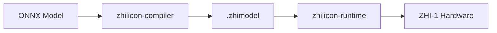

# Documentation Style Guide

This guide defines writing standards for all content in `zhilicon-developer-docs`. Consistent, clear documentation is critical for developer experience — apply these standards to every page, regardless of audience level.

---

## Principles

1. **Accuracy first.** Never document behavior that does not exist or is not confirmed. If uncertain, mark with `!!! warning "Under review"`.
2. **One concept per page.** Long pages are hard to navigate. Split topics generously.
3. **Lead with outcomes.** Start every guide with what the user will accomplish, not what the tool does.
4. **Show, then tell.** Provide a working code example before explaining the API in prose.
5. **Write for scanning.** Developers scan before they read. Use headers, tables, and code blocks to aid scanning.

---

## Voice and Tone

- **Second person.** Use "you" when addressing the reader, not "the user" or "one".
- **Active voice.** "The SDK returns a Tensor" not "A Tensor is returned by the SDK."
- **Present tense.** "The compiler emits a `.zhimodel` file" not "The compiler will emit..."
- **Direct.** Avoid filler: "simply", "just", "easily", "obviously". These words patronize readers.
- **Neutral.** Avoid marketing language ("blazing fast", "powerful", "revolutionary").

---

## Terminology

Use these terms consistently across all pages. Do not invent synonyms.

| Preferred | Avoid |
|-----------|-------|
| ZHI-1 chip | ZHI1, ZH1, the chip, the ASIC |
| SDK | toolkit, library, framework (unless technically correct) |
| `.zhimodel` | compiled model, binary, artifact |
| `ZHILICON_DEVICE=simulator` | sim, the simulator |
| Evaluation Board (ZHI-1 B0) | devkit, dev board, hardware kit |
| inference | prediction, forward pass (in user-facing docs) |
| throughput | images/sec, tokens/sec (use the specific unit, not "throughput" alone) |
| latency | response time, delay (except in hardware/performance pages) |

---

## Page Structure

Every page must follow this structure:

```
# Page Title

One or two sentence lead — what this page covers and why it matters.

---

## First Section

...

## Code Examples

All examples must be runnable with ZHILICON_DEVICE=simulator.

## See Also

- [Related page](../other-page.md)
```

---

## Code Snippets

### Requirements

- All Python examples must be runnable end-to-end under `ZHILICON_DEVICE=simulator`.
- Include `import zhilicon as zhi` at the top of every standalone snippet.
- Show expected output in a separate code block labelled `text` or `console`.
- Never include real API keys, tokens, or device identifiers.

### Formatting

Use language-annotated fenced code blocks:

````markdown
```python
import zhilicon as zhi

device = zhi.open_device()
print(device.capabilities())
```
````

Annotate expected output:

````markdown
```console
$ python example.py
Device: simulator  Backend: ZHI-1 functional model
Capabilities: fp16=True int8=True max_batch=256
```
````

### Tabs

Use tabbed code blocks when showing multiple language variants or SDK versions:

````markdown
=== "Python"
    ```python
    model = zhi.load_model("resnet50.zhimodel")
    ```

=== "C++ (low-level)"
    ```cpp
    auto model = zhi::LoadModel("resnet50.zhimodel");
    ```
````

---

## Admonitions

Use MkDocs Material admonitions sparingly — too many admonitions reduce their impact.

| Type | When to use |
|------|-------------|
| `!!! note` | Supplementary information that would interrupt the main flow |
| `!!! tip` | Genuinely non-obvious optimization or shortcut |
| `!!! warning` | Something that commonly causes errors or data loss |
| `!!! danger` | Security issue or irreversible action |
| `!!! info "Under review"` | Content that is draft or under verification |

---

## Diagrams

- Use Mermaid for flowcharts, sequence diagrams, and architecture diagrams.
- Prefer Mermaid over static images for all architecture diagrams — diagrams must be diffable.
- ASCII art is acceptable for inline terminal output reproduction only.



---

## Links

- Use relative links for all internal documentation links: `../api-reference/device.md`
- Use absolute HTTPS links for all external references.
- Do not link to internal GitHub URLs (`github.com/zhilicon-ai/internal-*`) — these are private repos.
- All external links in API reference must point to stable, versioned documentation.

---

## Headings

- **H1 (`#`)**: page title only — exactly one per page.
- **H2 (`##`)**: major sections — appear in the table of contents.
- **H3 (`###`)**: subsections within H2 — also appear in ToC.
- **H4 and below**: avoid. If you need H4, consider splitting the page.
- Use sentence case for headings: "Getting started with the compiler" not "Getting Started With The Compiler".

---

## Tables

Use tables for:
- Compatibility matrices
- Configuration options with type, default, and description
- Feature comparisons

Every table must have a header row. Column alignment:

| Column type | Alignment |
|-------------|-----------|
| Text | Left (default) |
| Numeric values | Right |
| Boolean / Yes/No | Center |
| Code | Left |

---

## Release Notes Format

Release notes in `docs/release-notes/` follow [Keep a Changelog](https://keepachangelog.com/en/1.1.0/) format:

```markdown
## [1.1.0] — 2025-06-15

### Added
- `zhi.profiler.power_trace()` for per-inference power measurement

### Fixed
- INT8 quantization mismatch on batch size > 128 (#ZHI-1234)

### Changed
- `zhi.open_device()` now returns `ZhiDevice` instead of `Device` for clarity
```

Sections: `Added`, `Changed`, `Deprecated`, `Removed`, `Fixed`, `Security`.

---

## Review Checklist

Before submitting a documentation PR:

- [ ] All code examples run to completion under `ZHILICON_DEVICE=simulator`
- [ ] Terminology matches the style guide table above
- [ ] No marketing language or filler words
- [ ] All links resolve (run `mkdocs build --strict`)
- [ ] Admonitions used only where necessary
- [ ] New pages added to `mkdocs.yml` nav
- [ ] Page title matches the `nav` entry in `mkdocs.yml`
